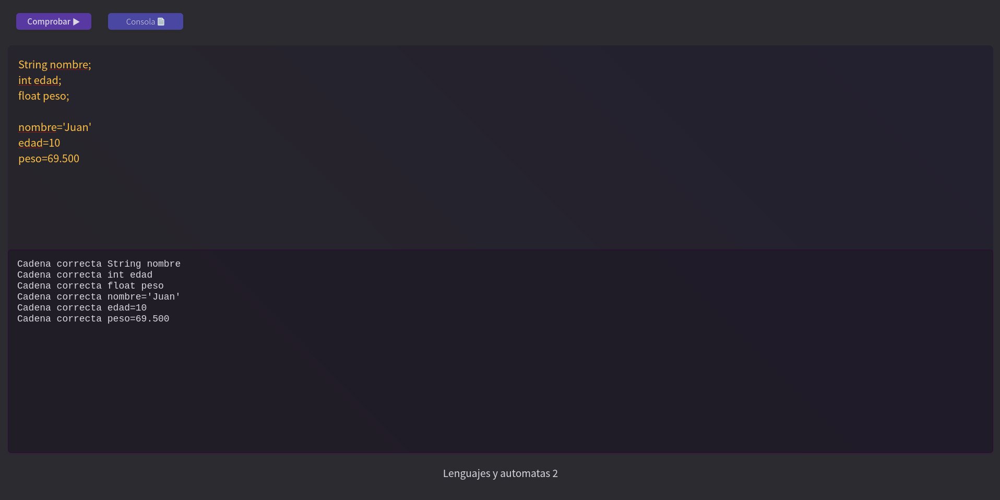

# Analizador_Sintactico
## Instalacion
### Instalación manueal
Instala Python 3
Instala nodeJS y npm

#### Configuración de python
```
pip install flask
```
#### Configuracion de NodeJs
```
cd codigoIntermedio
```
```
npm install
```
### Instalacion usando docker
Instala docker y docker compose en tu sistema operativo https://www.docker.com/get-started

### Ejecuta el proyecto
#### Ejecición manual
```
python3 main.py
```
```
cd codigoIntermedio
npm start
```
#### Ejecución con docker
```
docker-compose up
```
#### Ver el proyecto en linea
##### Primera version solo creacion de variables
https://analizadorsintactico.herokuapp.com/
##### Segunda version creacion de variables y asignacion de valores
https://analizadorsintacticoasignacion.herokuapp.com/
##### Tercera Entrega While
https://analizadorsintacticoas.herokuapp.com/


